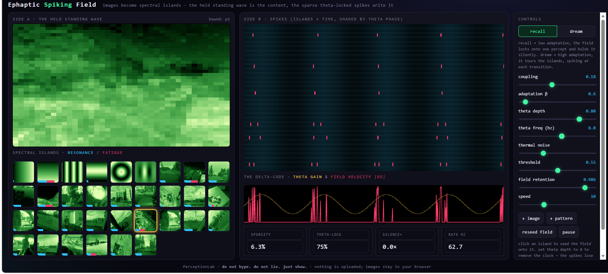
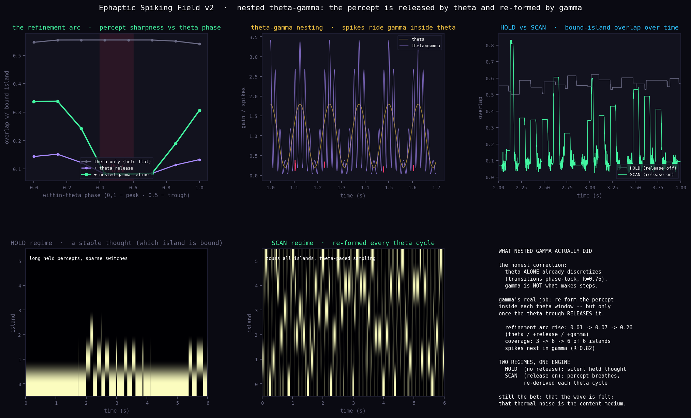

# Inner and Outer Qualia — the Ephaptic Spiking Field

*Part of the PerceptionLab / Geometric Neuron series.*
Repo: [anttiluode/InnerAndOuterQualia](https://github.com/anttiluode/InnerAndOuterQualia)



Try it live at: https://anttiluode.github.io/InnerAndOuterQualia/

One engine with two sides. A continuous **held standing wave** `s` — the content, the inner side — is written by **sparse, theta-locked spikes** from integrate-and-fire spectral islands — the communication, the outer side. The islands never touch each other directly; they talk only through the shared field. That is the ephaptic loop, and `W = Σ pₖpₖᵀ` is the holographic plate.

The inner side is the candidate for what is *felt*. The outer side is what an electrode would see. The repo is named for that split, and it is a split this code makes concrete without pretending to close it.

---

## What's here

**`ephaptic_spiking_field.html`** — the interactive tool. Self-contained, offline, no dependencies, nothing uploaded. Load images and they become the spectral islands (each downsampled to 40×40, zero-meaned, unit-normed). Watch both sides at once:

- **left** — the held standing wave, rendered as the field reconstructs itself from spikes (the content side).
- **right** — the spike raster shaded by theta phase, plus the delta-code trace (theta gain and field velocity `|ds|`), with live readouts.

**`ephaptic_spiking_field.py`** — the verified reference engine behind the tool, with two figure-generating demos. This is the rigorous version; the numbers below come from it.

**`the_clock_papers_and_the_spiking_field.md`** — an honest mapping from four mainstream 2025 results (Vollan/Moser theta sweeps; Drebitz/Kreiter gamma-phase gating; Baker & Cariani time-domain brain; Norman-Haignere time-yoked integration) to this system. Correlates, not confirmations — and it says which is which.

**`ephaptic_spiking_field_gamma.py`** + **`ephaptic_spiking_field_gamma.png`** — the v2 build: nested theta–gamma. The reference engine and figure for the result below.



**`the_nested_gamma_step.md`** — what adding gamma actually did, and the two corrections it forced.

---

## Run it

**Tool:** open `ephaptic_spiking_field.html` in any browser. It boots with six procedural spectral islands and runs immediately. Use **+ image** to add your own.

**Engine:**
```bash
pip install numpy matplotlib
python ephaptic_spiking_field.py
```
Writes `ephaptic_spiking_field.png` and prints the verified metrics.

---

## The two verified results

**1. The delta-code (distinct islands).** A percept is held *silently* and updated by spikes that are ~0.2% sparse and 100% theta-locked. The field is ~20–40× quieter during a dwell than at a transition. This is the clean delta-code the pure dreaming field could **not** produce — it needed the clock. Adding the theta clock and the spiking islands discretized the churn into a held percept updated by sparse, paced spikes.

**2. Emergent theta sweeps (direction-tiling islands).** Holding the non-circular standard — input only a constant heading bias, the theta clock, the island coupling, and adaptation; **never** a sweep direction, length, or parity — left–right alternation around the heading *emerges*, alternation score 1.00, sweep offset in the biological ~18–30° range. Turn adaptation off and it pins to heading (no alternation). One parameter switches the whole phenomenon on and off. This is the Vollan/Moser left–right theta sweep, reproduced inside the unified spiking-field engine.

**3. Nested theta–gamma: HOLD vs SCAN (v2).** The next-step build added gamma sub-cycles inside each theta window. The honest finding corrected the framing: **theta alone already discretizes** (transitions phase-lock, staircase index ~87) — gamma is not what makes the steps. Gamma's real job is to *re-form* the percept inside each theta window, but only once the theta trough **releases** it. With release on, a refinement arc appears (overlap dissolves to ~0.08 at the trough and gamma re-forms it to ~0.34 by the peak; arc rise 0.014 → 0.070 → 0.256), the system tours all islands, and spikes nest in gamma (phase concentration 0.82 = theta–gamma coupling). This gives **two regimes, one engine**: HOLD (release off — a silent held thought) and SCAN (release on — the percept breathes, re-derived every theta cycle). SCAN is the same release-and-reform mechanism as the ring sweep.

---

## Using the tool

- **recall / dream** — really just the adaptation slider. Recall: the field locks onto one percept and holds it silently. Dream: it tours the islands, spiking at each transition.
- **theta depth** — the important one for the theory. Set it to **0** to remove the clock and watch the clean delta-code dissolve into churn, live. That single slider is the Baker–Cariani churn-vs-nesting prediction and the Vollan theta-dependence, in your hand.
- **gamma depth** and **release (hold↔scan)** — the v2 controls. Leave them at zero for the held delta-code. Turn them up together and the percept dissolves at each theta trough and re-forms by the next peak: HOLD becomes SCAN, touring the islands on the theta beat.
- **coupling** — how strongly spikes write the field.
- **thermal noise** — the Johnson–Nyquist dither on the islands' subthreshold state.
- **threshold / field retention / theta freq / speed** — the rest of the knobs.
- Click any island thumbnail to seed the field onto it. The blue/red bars under each thumbnail are its current **resonance** with the field and its **fatigue**.

Readouts: spike **sparsity**, **theta-lock** %, **silence ratio** (field velocity at transitions ÷ during dwells), and firing **rate**. With distinct islands the silence ratio climbs; with highly correlated natural photos the field can stay locked, and the ratio stays low — that's the dynamics being honest, not a bug.

---

## What this shows, and what it doesn't

**Shown (verified):** a held standing wave updated by sparse, theta-locked spikes (the two sides, separated cleanly by the clock); emergent, internally-generated, theta-gated left–right alternation switched by adaptation alone; the loss of the discrete code when the clock is removed.

**The bet (not shown):** that the held standing wave is *experienced* from the inside — the "inner qualia." This engine hands you the exact self-sustaining enslaved wave you would have to claim is felt; the same dynamics run identically whether or not anything is felt. The hard problem is sharpened here, not solved.

**Also not modeled:** that Johnson–Nyquist thermal noise is the *medium* of the content rather than the dither it currently is.

**The next build** all four papers point at: nested gamma — a handful of refinement steps inside each theta cycle (bounded iteration). **Now built (v2):** it forced an honest correction — theta already discretizes; gamma's job is to re-form the released percept inside each theta window, giving the HOLD↔SCAN split. See `the_nested_gamma_step.md`.

---

*PerceptionLab / Antti Luode, with Claude (Opus 4.8). Helsinki, June 2026.*

**Do not hype. Do not lie. Just show.**
